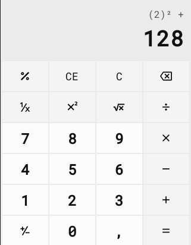

# java-windows-calculator

Precisão: IEEE 754R [Decimal128](https://en.wikipedia.org/wiki/Decimal128_floating-point_format) (34 dígitos decimais)

## Atalhos de teclado

| Tecla        | Ação                                  |
| ------------ | ------------------------------------- |
| `0` - `9`    | Dígitos da entrada                    |
| `.` ou `,`   | Separador decimal **\***              |
| `Delete`     | Limpa a entrada atual (CE)            |
| `Esc`        | Limpa tudo (C)                        |
| `Enter`, `=` | Exibe o resultado (=)                 |
| `F9`         | Altera o sinal da entrada (+/-)       |
| `R`          | Inverte a entrada (1/x)               |
| `@`          | Raiz quadrada da entrada (2√x)        |
| `%`          | Porcentagem (%)                       |
| `Q`          | Eleva a entrada ao quadrado (x&#178;) |
| `/`          | Divisão (&#247;)                      |
| `*`          | Multiplicação (&#215;)                |
| `-`          | Subtração (-)                         |
| `+`          | Soma (+)                              |

**\*** - Depende do ambiente em que está sendo executado
